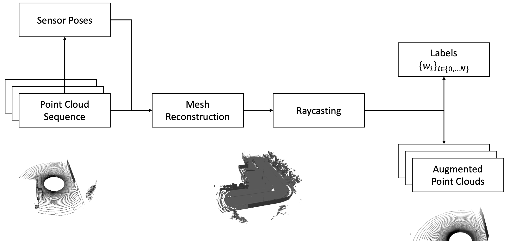

<div align="center">

# LiDAR Augmentation

[](https://github.com/pre-commit/pre-commit)
[](https://github.com/psf/black)
[](https://pytorch.org/get-started/locally/)
[](https://pytorchlightning.ai/)
</div>

## Description


  
Novel-View Synthesis for LiDAR point clouds.

## Install

A suitable conda environment named `lidar-augmentation` can be created and activated with:
```
conda env create -f environment.yaml
conda activate lidar-augmentation
```

<b>Note:</b> Data generation and evaluation require CARLA 0.9.10 

## Generate Data

## Training

## Run Evaluation
