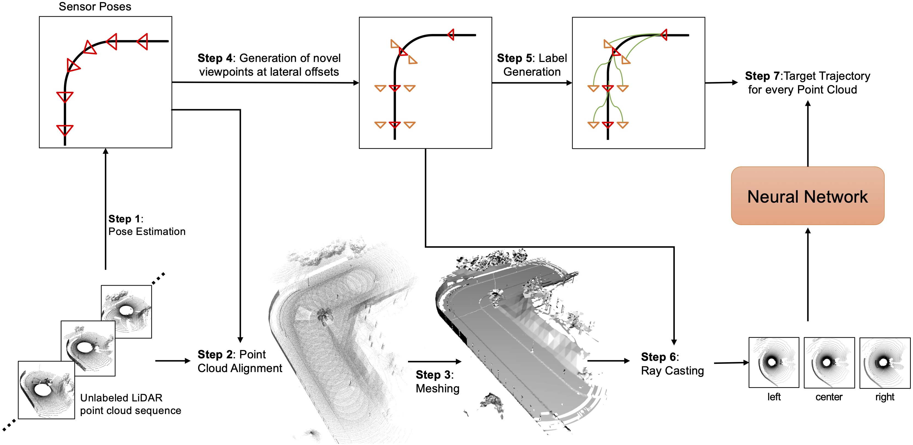

<div align="center">

# LiDAR View Synthesis for Robust Vehicle Navigation Without Expert Labels
  
### [Project Page](https://jonathsch.github.io/lidar-synthesis/) | [Arxiv](https://arxiv.org/abs/2308.01424)
  
[Jonathan Schmidt](https://github.com/jonathsch)<sup>1,2</sup>,
[Qadeer Khan](https://cvg.cit.tum.de/members/khamuham)<sup>1,2</sup>
[Daniel Cremers](https://cvg.cit.tum.de/members/cremers)<sup>1,2,3</sup><br>
<sup>1</sup>Technical University of Munich<br>
<sup>2</sup>Munich Center for Machine Learning (MCML)<br>
<sup>3</sup>University of Oxford<br>
  
[](https://github.com/pre-commit/pre-commit)
[](https://pytorch.org/get-started/locally/)
[](https://pytorchlightning.ai/)
</div>

## Description

  
Deep learning models for self-driving cars require a diverse training dataset to manage critical driving scenarios on public roads safely. This includes having data from divergent trajectories, such as the oncoming traffic lane or sidewalks. Such data would be too dangerous to collect in the real world. Data augmentation approaches have been proposed to tackle this issue using RGB images. However, solutions based on LiDAR sensors are scarce. Therefore, we propose synthesizing additional LiDAR point clouds from novel viewpoints without physically driving at dangerous positions. The LiDAR view synthesis is done using mesh reconstruction and ray casting. We train a deep learning model, which takes a LiDAR scan as input and predicts the future trajectory as output. A waypoint controller is then applied to this predicted trajectory to determine the throttle and steering labels of the ego-vehicle. Our method neither requires expert driving labels for the original nor the synthesized LiDAR sequence. Instead, we infer labels from LiDAR odometry. We demonstrate the effectiveness of our approach in a comprehensive online evaluation and with a comparison to concurrent work. Our results show the importance of synthesizing additional LiDAR point clouds, particularly in terms of model robustness.

## Install

<b> Note: </b> Generating data and running the evaluation requires CARLA 0.9.10. Please refer to the [official documentation](https://carla.readthedocs.io/en/0.9.10/) for install instructions.

A suitable conda environment named `lidar-synthesis` can be created and activated with:
```
conda env create -f environment.yaml
conda activate lidar-synthesis
pip install -e .
```

## Generate Data

1. Navigate to the directory of your CARLA installation and launch a CARLA server by running:
```
DISPLAY= ./CarlaUE4.sh --world-port=2000 -opengl
```

2. Once the CARLA server is running, run the following script:
```
python scripts/generate_data.py [ROUTE_ID] [SAVE_DIR]
```
where `[ROUTE_ID]` is the ID of the route you want to generate data for. Our pre-defined routes have IDs from 0 to 7. Addtional routes can be added in `scripts/data_generation.py` by adding a new entry to the global variable `SPAWN_POINTS`. `[SAVE_DIR]` is the directory where the data will be stored.

3. To run the data augmentation pipeline, run the following script:
```
sh scripts/run_augmentation_pipe.sh [DATA_DIR]
```
where `[DATA_DIR]` is the directory where the data is stored, i.e. `[SAVE_DIR]/path/to/route` The augmented data will be placed in the same directory.

## Training

1. Open the config file `configs/paths/default.yaml` and set `data_dir` to the directory where you generated the data, i.e. `[SAVE_DIR]` from the previous step.

2. Launch the training by running:
```
# Train on CPU (slow)
python lidar_synthesis/train.py

# Train on GPU
python lidar_synthesis/train.py trainer=gpu

# Use wandb logger
python lidar_synthesis/train.py trainer=gpu logger=wandb

# Any hyperparameter can be overwritten by adding it to the command line
python lidar_synthesis/train.py trainer=gpu model.learning_rate=0.01
```

## Run Evaluation

1. Adjust the CARLA paths in `lidar_synthesis/leaderboard/scripts/local_evaluation.sh` to point to your CARLA 0.9.10 installation
2. In the same file, set `TEAM_AGENT` to one of the following:
    - `${WORK_DIR}/lidar_synthesis/agents/lidar2waypoints_agent.py`
    - `${WORK_DIR}/lidar_synthesis/agents/lidar2steering_agent.py`
    - `${WORK_DIR}/lidar_synthesis/agents/camera_agent.py`
3. In the same file, set `CHECKPOINT_ENDPOINT` to the file you want the result to be written to.
4. Navigate to the directory of your CARLA installation and launch a CARLA server by running:
```
DISPLAY= ./CarlaUE4.sh --world-port=2000 -opengl
```

5. Once the CARLA server is running, evaluate the agent with the script:
```
./lidar_synthesis/leaderboard/scripts/local_evaluation.sh
```

## Acknowledgements

- The project structure and configuration utilities are based on [this](https://github.com/ashleve/lightning-hydra-template) template
- The evaluation code is mainly borrowed from [Transfuser](https://github.com/autonomousvision/transfuser)

## Citation

If you find our work useful in your research, please consider citing:
```
@article{schmidt2023lidar,
  title={LiDAR View Synthesis for Robust Vehicle Navigation Without Expert Labels},
  author={Schmidt, Jonathan and Khan, Qadeer and Cremers, Daniel},
  journal={arXiv preprint arXiv:2308.01424},
  year={2023}
}
```
