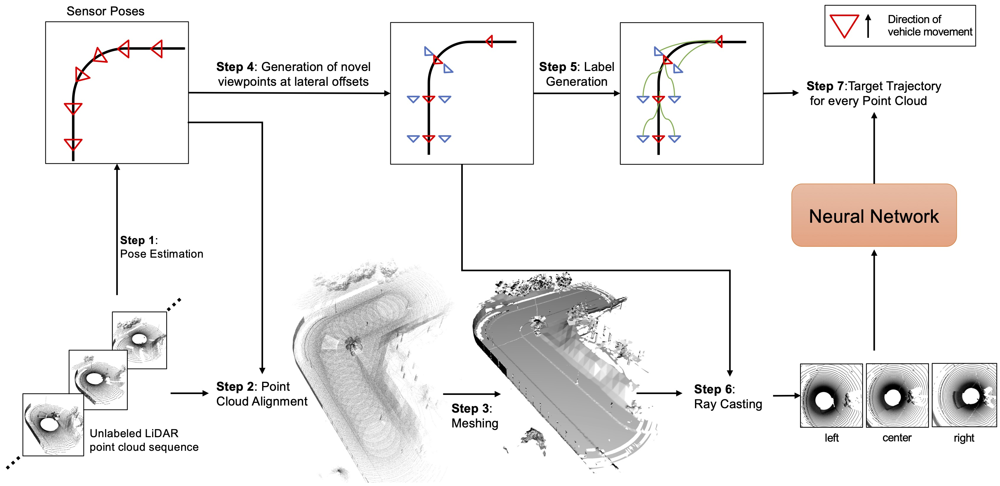

<div align="center">

# LiDAR View Synthesis for Robust Vehicle Navigation Without Expert Labels
  
### [Project Page](https://jonathsch.github.io/lidar-synthesis/)
  
[Jonathan Schmidt](https://github.com/jonathsch)<sup>1</sup>,
[Qadeer Khan](https://cvg.cit.tum.de/members/khamuham)<sup>1</sup>
[Daniel Cremers](https://cvg.cit.tum.de/members/cremers)<sup>1</sup><br>
<sup>1</sup>Technical University of Munich
  
[](https://github.com/pre-commit/pre-commit)
[](https://pytorch.org/get-started/locally/)
[](https://pytorchlightning.ai/)
</div>

## Description

  
Deep learning models for self-driving cars require a diverse training dataset to safely manage critical driving scenarios on public roads. This includes having data from divergent trajectories such as the oncoming traffic lane or sidewalks. Such data would be too dangerous to collect in the real world.  Data augmentation approaches have been proposed to tackle this issue using RGB images. However, solutions based on LiDAR sensors are scarce. We therefore propose an approach to synthesize additional LiDAR point clouds from novel viewpoints without having the need to physically drive at dangerous positions. The LiDAR view synthesis is done  using mesh reconstruction and ray casting. We train a deep learning model, which takes a LiDAR scan as input and predicts the future trajectory as output. A waypoint controller is then applied on this predicted trajectory to determine the throttle and steering labels of the ego-vehicle. Our method neither requires expert driving labels for the original nor for the synthesized LiDAR sequence. Instead, we infer labels from LiDAR Odometry. We demonstrate the effectiveness of our approach in a comprehensive online evaluation and with a comparison to concurrent work. Our results show the importance of synthesizing additional LiDAR point clouds, particularly in terms of model robustness.

## Install

<b> Note: </b> Generating data and running the evaluation requires CARLA 0.9.10. Please refer to the [official documentation](https://carla.readthedocs.io/en/0.9.10/) for install instructions.

A suitable conda environment named `lidar-synthesis` can be created and activated with:
```
conda env create -f environment.yaml
conda activate lidar-synthesis
pip install -e .
```

## Generate Data
Comming soon.

## Training
Comming soon.

## Run Evaluation

1. Adjust the CARLA paths in `lidar_synthesis/leaderboard/scripts/local_evaluation.sh` to point to your CARLA 0.9.10 installation
2. In the same file, set `TEAM_AGENT` to one of the following:
    - `${WORK_DIR}/lidar_synthesis/agents/lidar2waypoints_agent.py`
    - `${WORK_DIR}/lidar_synthesis/agents/lidar2steering_agent.py`
    - `${WORK_DIR}/lidar_synthesis/agents/camera_agent.py`
3. In the same file, set `CHECKPOINT_ENDPOINT` to the file you want the result to be written to.
4. Navigate to the directory of your CARLA installation and launch a CARLA server by running:
```
DISPLAY= ./CarlaUE4.sh --world-port=2000 -opengl
```

5. Once the CARLA server is running, evaluate the agent with the script:
```
./lidar_synthesis/leaderboard/scripts/local_evaluation.sh
```
